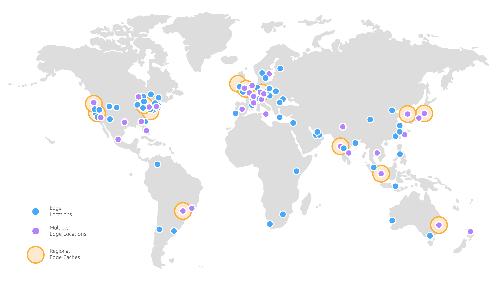
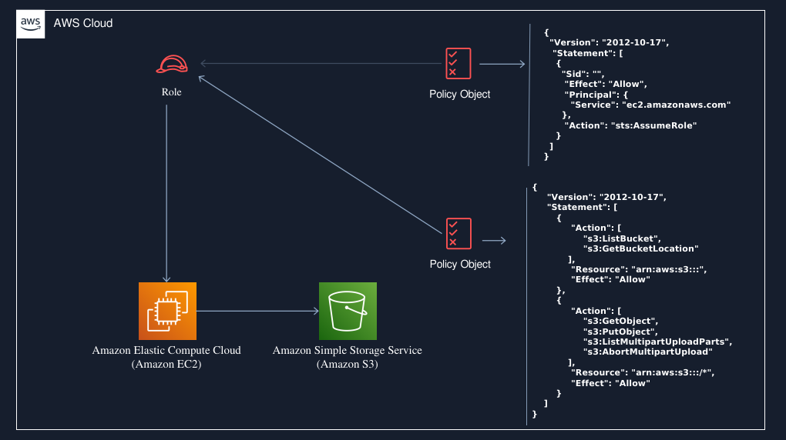
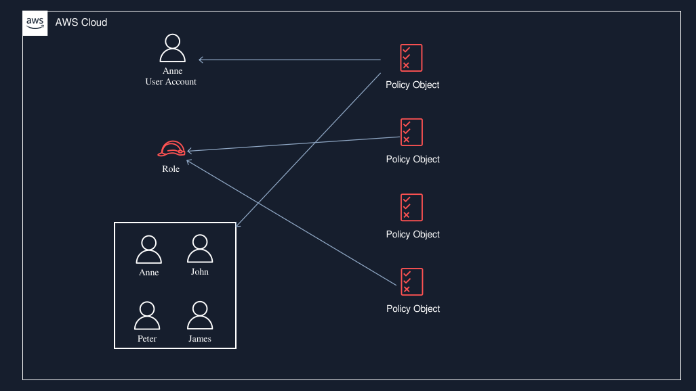
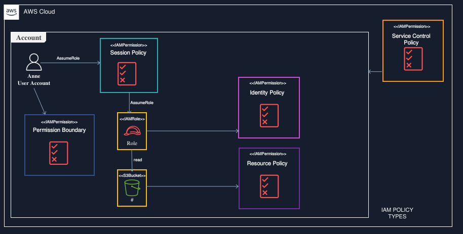

# AWS IAM: Access Control compared to how an International Airport works

## Introduction

Today, cloud computing is the backbone of the digital operations of thousands of companies around the world. At the heart of this dynamic ecosystem is Amazon Web Services (AWS), a platform that not only offers storage and processing, but also enables the construction of complex and scalable solutions. To understand the grandeur and functionality of this global infrastructure, we can draw a fascinating parallel with the map of airports around the world.


Think of AWS as a vast, interconnected airport system, where each region and service is a vital hub that communicates with the rest of the network. Just as airports are responsible for managing air traffic and ensuring that millions of passengers and cargo arrive at their destinations safely and efficiently, AWS manages a constant flow of data and applications, ensuring that information is delivered accurately and in a timely manner. 

In this context, AWS Identity and Access Management (IAM) acts as the access control system for these airports, ensuring that only authorized passengers—or rather, users and services—can access critical areas and board their flights to the cloud.



By exploring this analogy, we’ll see how IAM is critical to security across most AWS services. Just as each airport has strict security standards and different boarding gates that determine where passengers can go, IAM defines who can access what across the vast array of AWS resources. Let’s take this comparison a step further by examining how AWS IAM and its credentials function as a sophisticated control system in an airport, providing the efficiency and security needed to operate in a complex, global environment.

In the digital world, security and access control are paramount. When it comes to cloud services like Amazon Web Services (AWS), AWS IAM (Identity and Access Management) stands out as one of the pillars for managing who can do what within your infrastructure. To better understand the complexity and importance of AWS IAM, let’s compare it to that of an airport.


**The Airport: An Access Control System**

Imagine an airport, where each person (passenger) has a specific role.

Passengers.

Employees.

Outsourcers.

Each has a type of authorization that determines how they can interact with the environment. This ecosystem reflects the functioning of AWS IAM, where users, groups, and permissions ensure that only the right people have access to the right resources.

Before learning about IAM, we need to understand how an airport works:

### 1. Airport Structure

An airport is a complex facility composed of several areas and functions that work together. Here are the main components:

**Passenger Terminal:** Where passengers check in, go through security, wait for boarding, and disembark.

Runways and Taxiways: Infrastructure for aircraft takeoff and landing, as well as paths for aircraft movement on the ground.

**Hangar:** Structures where aircraft are stored, maintained and sometimes repaired.
**Control Tower:** Location from which air traffic controllers monitor and manage flights, both within the airspace and during taxiing operations at the airport.
**Cargo Area:** Specific sections for handling cargo and goods that are transported by cargo aircraft.

### 2. Operating Processes
**A. Arrival and Check-in**
Check-in: Passengers arrive at the terminal and check-in, which can be done at automatic kiosks or at the airline counter. Here, passengers receive their boarding pass and have their bags checked.

Document Verification: Check-in also involves presenting documents, such as passport and visa, ensuring that passengers are authorized to travel.

**B. Security and Control**
Security Control: Before entering the boarding area, all passengers go through security procedures. This includes screening of carry-on baggage and checking of personal items to ensure that there are no prohibited materials on board the aircraft.

Clearing Immigration (on international flights): For international flights, passengers must go through immigration control, where their documents are checked again.

**C. Access to the Boarding Area**
Waiting Room: After passing through security, passengers enter the waiting room, where they can wait until boarding time. This area may have a variety of amenities, such as shops, restaurants, and lounges.

Boarding: When the time comes, passengers are called in groups to board the aircraft. Boarding is often orderly, ensuring that everyone follows an organized flow.

**D. Flight**
Takeoff: After boarding, the aircraft taxis to the runway, where it awaits clearance from the control tower. Safety is always a priority, with controllers managing traffic.

Flight: During the flight, pilots follow pre-defined flight paths and communicate regularly with air traffic controllers to ensure safety and efficiency.

### E. Deplane and End of Trip
**Landing:** Upon approaching the destination, the aircraft receives instructions from the control tower for landing, where safety and precision are critical.

**Deplane:** After parking, passengers disembark and proceed to immigration (if necessary) and baggage claim.

**Baggage Claim:** Passengers collect their bags from the designated area of ​​the terminal and complete their experience, whether departing for the city or connecting to another flight.

### 3. Deplane and Maintenance
**Aircraft Maintenance:** After a flight, aircraft undergo maintenance and cleaning, readying them for the next flight. **Airport Management:** All airport operations are managed by an administrative team, which takes care of logistics, customer service, security and maintenance of the facilities.


## Check-in: Creating Users and Groups

When you start and create your account, **AWS has AWS Identity & Access Management (IAM)**, this AWS service **is free of charge** but its **importance is vital**, as it defines the use of each of the more than [240 services](https://www.aboutamazon.com.br/o-que-fazemos/amazon-web-services) offered in, but when we analyze the global infrastructure it is something very large:

The AWS Cloud covers **108 availability zones** in **34 geographic regions**, with plans announced for another **18 availability zones** and **six more AWS regions** in Mexico, New Zealand, Kingdom of Saudi Arabia, Thailand, Taiwan and in the AWS European sovereign cloud. With **41 local zones**, **29 Wavelength zones** for ultra-low latency applications, **245 countries and territories served**, and **135 Direct Connect locations**. Let’s rethink the AWS cloud characteristics. It can be compared to a vast **network of interconnected airports** around the world.** There are currently **108 distribution terminals** (availability zones)__ spread across **34 international hubs** (geographic regions)__, with plans to add 18 more terminals and six new hubs in strategic locations**, including Mexico, New Zealand, Kingdom of Saudi Arabia, Thailand, Taiwan, and a **sovereign cloud in Europe**.

Within this network, __there are 41 local airports__ that serve specific areas, providing __nearby connectivity to users__. In addition, AWS has **29 Wavelength terminals**, optimizing operations for applications that **require ultra-low latency**, such as real-time air traffic systems.**

In total, this extensive structure serves **245 countries and territories**, ensuring that passengers and cargo **can efficiently connect** to **135 destinations on Direct Connect**, enabling fast and secure data transfer**, as well as the transfer of **passengers between different points of the globe**.

When we recontextualize it in terms of airports and their global operations, it makes it easier to understand through **this analogy**.

## The root user:

In an airport, airlines such as **American Airlines** and **Gol Linhas Aéreas** rent **offices to operate and offer flights** to their customers. There are large international airlines, such as **Lufthansa**, that connect several continents, as well as smaller airlines, such as **Azul**, that carry out local operations in specific markets.

When an airline decides to operate at an airport, it signs a contract (terms of use), which we sign when registering with AWS, to use the services offered by that facility (AWS).

Let's suppose that Delta Air Lines, for example, makes this arrangement; its regional manager, who represents the company at that airport, signs the contract and, in this way, obtains the "keys" to the office, allowing him and his team to access all the areas necessary for the operation of flights.

In this case, there are certain laws that require certain niches to keep their data only in the Region of use, obeying the laws of that Country (Availability Zones), for example, financial clients and hospitals.


The regional manager of an airline, such as Delta Air Lines, cannot run the office alone. To ensure that everything runs smoothly, he or she must hire a team, which may include sales agents, operations agents, baggage handlers, flight dispatchers, and administrative support.

Ultimately, the manager distributes responsibilities while providing oversight.

Similarly, when you first create an AWS account, you are given a unique login identity called the root user, which has full access to all services and resources.

Although you can perform any task as the root user using the account email and password, AWS strongly recommends that this user not be used for day-to-day activities, even administrative ones. Instead, you should create **IAM users**, **assign specific permissions** to them, and **keep the root user credentials secure**, reserving their use only for essential management tasks - so that the account can also "rest", and protect against potential root user-related issues.

## IAM Users:

Just as passengers check in before boarding, in AWS IAM, you start by creating users and groups. Users represent individuals or services that need access to your AWS resources. Groups are like check-in lines, where you can group users with similar needs.

**Users:** Each user is assigned credentials (equivalent to a boarding pass) that identify them and grant them access to your AWS account.


Suppose an airline manager, such as **American Airlines**, has hired several people to perform different functions at the airport.
He has assigned **specific credentials and permissions** to each of them. For example, **sales agents** are at the front desk, directly interacting with customers, but they never have access to the **boarding area**. In contrast, **baggage handlers** are **authorized to enter the airside area**, where they can **carry luggage onto the aircraft**.

Similarly, in AWS, an **IAM user** represents an entity** created to interact with **cloud services**. Just like at the airport, each **AWS user** has a **name and credentials** that determine which services and resources it can access, **depending on the permissions it has been assigned.**

When a new **IAM user** is created through the AWS CLI, AWS API, or console, it initially has no credentials. Just as a manager needs to assign credentials to employees based on their responsibilities, you must also create the type of credentials required for an IAM user, according to their specific roles in AWS. At some point, some of these users may have permissions in other airports than their credentials. In this case, AWS has **AWS Organizations** where you can enable or disable zones, which would be the same as restricting that employee's access to another airport, limiting their credentials to only a geographic area, such as the Americas. They would not have access to airports in Europe.

There is more: the manager has to create this amount and managing this becomes difficult and complex. In this case, AWS provides **Control Tower**, which allows better control of the organizational environment when creating users.


## IAM Groups

Groups: Groups organize users with **similar permissions**, simplifying management. A “Baggage Handling” group, for example, might have specific permissions to manage access to the airport baggage area and also the arrival and departure areas where aircraft are parked.

Are you familiar with **access cards**? These cards are used to grant **access to restricted areas** to those who have them. Thus, the airport manager can program which **doors or areas will be accessible** with each card.

In this scenario, the manager has decided to provide access cards of different colors to employees, according to the permissions they need. For example:

A group of ten people.

Responsible for **aircraft maintenance**.

They all received **orange cards**, which allow access to the restricted areas where aircraft maintenance takes place.

Now, let's imagine that an employee from the **maintenance group is promoted** to a new role. What happens then? It's simple: **he will be part of another group**, return his orange card and **receive a new card** that will give him access to the **areas necessary for his new role.**


At the airport, an employee group can be compared to a set of access users. These groups allow a manager to specify permissions for a collective of employees, making it easier to manage their credentials.

For example, a manager might have a group called "air traffic controllers" and assign that group the permissions needed to operate the service desk. Any employee who joins that group will automatically have the permissions assigned to them.

If a new employee joins the airport team and needs customer service privileges, they can simply add them to the "air traffic controllers" group and they will receive the appropriate permissions. Likewise, if an employee changes roles, instead of changing their permissions individually, the manager can remove them from their previous group and add them to the new group as needed.

**Additional Information on Groups:** - Groups can contain multiple users, but they cannot contain other Groups or Roles. - A user does not need to belong to any IAM Group.
- A User can belong to multiple Groups.

## IAM Roles

First we must understand what an IAM Role is.

**1. What is an IAM Role?**

An IAM Role is an **identity that has specific permissions**. Roles are used to delegate access to AWS services and resources without the need to create permanent credentials.

Knowing then that an IAM Role in AWS is like a **temporary access card** that is issued to employees or systems at the airport, we can then understand that this access allows the employee or third parties, a person outside of our employees, for example an auditor from an institution, who **receives this temporary credential** to access specific areas or perform certain tasks only when **necessary and for a limited period**.

**2. How IAM Roles Work:**
**Role Assumption:** Imagine that an aircraft maintainer who normally works in the maintenance area needs to **temporarily access the boarding area** to transport tools or **perform a check**. Instead of having a permanent access card for that area, he can **"assume" a role** that gives him the necessary permission for a **limited time**. This is a form of dynamic access control.

**Temporary Credentials:** Once the maintainer assumes the role, he is given **temporary credentials (such as a code or card)** that allow him to access the boarding area only during the time he actually needs to be there, **ensuring that he does not have unlimited access.**

**3. Common Usage Scenarios:**
**Loading and Unloading Crew:** Crew members who handle baggage loading may need access to the landing strip from time to time. **An IAM Role can be created specifically for this function**, allowing employees to assume the role when they are performing this work, ensuring that only the right people have access to the area when needed.

**Temporary Security:** Let’s say there is a special situation where **airport security staff need access to the control room** or a **restricted area** to ensure **security during an event**. They can use a role that grants them this temporary access, **ensuring that they can act quickly and efficiently without needing to have continuous access**

**But how does this work within AWS?**



The AssumeRole feature in AWS Identity and Access Management (IAM) is a mechanism that allows a user or service to **"assume" a temporary role** that grants specific permissions to perform actions across different AWS services. This feature is critical for delegating access and managing permissions in complex environments.

### How AssumeRole Works
**Creating a Role:** An AWS IAM administrator creates an IAM Role with a specific set of permissions (policies) and defines which entities are allowed to assume that role. The IAM Role is not associated with a particular user; instead, it can be used by multiple users, services, or even applications in AWS.

**Permission to Assume the Role:** The trust policy associated with the role defines which entities (users, services, or accounts) can assume that role. For example, a role might allow a user in account A to assume a role in account B.

**Assuming the Role:** When an entity **(such as a user or an EC2 instance)** needs to perform actions for which it **does not have permissions**, it executes the **AssumeRole** operation. This generates temporary credentials that **allow the entity to act under the permissions defined by the role**.

**Using Temporary Credentials:** Once **AssumeRole** is successful, the entity receives a temporary set of credentials **(Access Key ID, Secret Access Key, and Session Token)** that can be used to interact with AWS services according to the **permissions of the role.

**Temporary Credentials Duration:** These credentials have a configurable limited duration (typically a few minutes to a few hours) and do not need to be saved or managed permanently.

### Common Usage Scenarios for AssumeRole
**Delegation of Responsibilities:** A user in one account can assume a role in another account to perform specific tasks, enabling collaboration between different accounts without sharing permanent credentials.

**Temporary Access:** Applications running on EC2 instances can assume roles to access other AWS services (such as S3, DynamoDB, etc.) without the need to store permanent credentials.

**Event-Driven Systems:** Allow Lambda functions to assume roles to perform specific tasks when triggered by events, such as accessing databases or storage services.

**Elevated Privileges:** Users may have the ability to assume a role with elevated permissions for temporary administration or configuration that are not enabled by default.

### Practical Example:
Suppose you have a role named **"AdminRole"** with administrative permissions to **manage AWS resources**. The role has a trust policy that allows **users from account A to assume it**.

- A user from account A makes an API request to AssumeRole for the role "AdminRole".

- AWS verifies the trust defined in the role policy and, if approved, authenticates the request.
- The user is provided with temporary credentials for the role.
- With these credentials, the user can manage resources as permitted by the "AdminRole" role.


## Multi-Factor Authentication (MFA)

**1. What is MFA?**
Multi-Factor Authentication (MFA) is a method of confirming a person’s identity that requires more than one factor for authentication. In the context of an airport, this can be compared to a security system that requires an employee to present multiple forms of identification before gaining access to restricted areas.

**2. How MFA Works at the Airport:**
**Factor 1:**
- **Identification (ID) Card:** The first factor could be the employee’s identification card, **similar to a badge** that proves they are a member of the airport staff, allowing access to specific areas. **This card typically contains some basic information and a photo.**

**Factor 2:**
- **Access Code (Password or PIN):** The second factor is an **access code or PIN** that the employee must enter when presenting their **ID card**. This code can be generated by a device, **such as a security token or a smartphone**, and changes regularly to ensure additional security.

**3rd Factor (Optional):**
- **Biometrics:** To further strengthen security, **the airport can implement a third factor**, such as **biometric verification (e.g., a fingerprint or facial recognition)** at the entrance to highly sensitive areas, such as the **control room or the runway**.

## IAM Policies (Permissions)

An IAM user, group, or role can be assigned a JSON document called an IAM Policy, for example:

**1. What are IAM Policies?**

In the context of AWS, **IAM Policies are rules that define the permissions that users** or **groups have regarding actions on specific resources**.

In an airport, these policies can be compared to **rules and regulations that determine who can do what in different areas of the airport**.

**2. Types of Airport Policies:**
To better understand, let's consider different types of policies that could **exist in an airport:**

**Area Access Policy:** A policy that defines which employees can access which areas of the airport. For example, only maintenance personnel can access the aircraft maintenance area. This policy might specify that only members of a named group, such as **"Maintainers", have access to certain areas, such as the runway or hangar.**

**Action Policy:** This policy determines what actions an **employee can take in a specific area**. For example, a security officer may have permission to **"inspect" and "ticket"** in the **secure** zone, while a **check-in** agent may have permission to **"check-in"** and **"issue boarding passes"**.

**Compliance Policy:** These policies can ensure that employees follow **regulatory procedures**. For example, all employees must undergo security training before gaining access to **restricted areas**. The policy may require new employees to complete this training in order to **receive their access credentials**.

**3. How It Works in Practice:**
**Imagine that a new employee is hired** at the airport. To ensure that permissions are appropriate, **the security manager configures the following IAM Policies:**

**Defining Groups:** The manager creates groups for different roles, such as **"Security"**, **"Maintenance"**, **"Customer Service"**. This makes it easier to organize permissions.


**Assigning Permissions:** The manager then defines policies that connect these groups to actions and areas. For example:

**Security Group:** Permission to perform inspections, monitor cameras, control entry and exit.

**Maintenance Group:** Permission to access hangar areas, operate maintenance equipment.

**Customer Service Group:** Permission to access check-in and boarding areas, issue boarding passes.

**Policy Review and Update:** As employees change roles or new procedures are implemented (such as a new type of security check), policies need to be reviewed and updated.

If a maintenance team member is promoted to a security position, **they can be removed from the maintenance group and assigned to the security group**, automatically changing their permissions.

**4. Importance of IAM Policies at the Airport:** Permission policies are crucial to the safe and efficient operation of an airport because they ensure that:

- Only authorized individuals have access to specific areas and resources.

- Actions taken by employees are monitored and controlled.
- Compliance with security and operational regulations is maintained.

**5. Practical Example:**
Consider a time when the security team at the gate area **needs to access incident logs**. The IAM Policies would define:

**Who Has Access:** Only members of the **"Security"** group.

What Actions Can Be Taken: They can **"view"** and **"log"** incidents, but not **"edit"** or **"delete"** historical records.

Okay, but one detail: how are these IAM policies defined?

We can see these elements within the JSON of a policy document by examining any of the existing policies available to us in our AWS account.

Let's take a look at the one we're already familiar with – the **AdministratorAccess policy:**

```json
{
 "Version": "2012-10-17",
 "Statement": [
    {
    "Effect": "Allow",
    "Action": "*",
    "Resource": "*"
    }
 ]
}
```
Note that this policy gives permission to all resources, that is, you can access and use any part of the airport, **create, edit, change and delete** anything within your account.

```json
{
  "Version": "2012-10-17",
  "Id": "MyPolicy",
  "Statement": [
    {
      "Sid": "FirstStatement",
      "Effect": "Allow",
      "Action": ["iam:ChangePassword"],
      "Resource": "*"
    },
    {
      "Sid": "SecondStatement",
      "Effect": "Allow",
      "Action": "s3:ListAllMyBuckets",
      "Resource": "*"
    },
    {
      "Sid": "ThirdStatement",
      "Effect": "Allow",
      "Action": [
        "s3:List*",
        "s3:Get*"
      ],
      "Resource": [
        "arn:aws:s3:::confidential-data",
        "arn:aws:s3:::confidential-data/*"
      ],
      "Condition": {"Bool": {"aws:MultiFactorAuthPresent": "true"}}
    }
  ]
}

```

In this case, we already have a policy, segmented with each action specified and the resources that will receive this policy, directly in the user or within a group, or within a Role.

### Evaluation logic

After collecting the effective statements using the filters, it uses the policy evaluation logic to decide whether the request is allowed. The AWS documentation has a descriptive image to summarize how it works:


#### Types of policies
There are different types of policies, depending on what they are attached to:

- SCP: attached to the account via Organizations
- Resource-based policy: attached to the resource being called, such as an S3 bucket
- ​​Permission boundary: attached to an identity as a boundary
- Session policy: attached to the assume role session
- Identity-based policy: attached to an identity, such as an IAM user



SCP, permissions boundary, and session-based policy are specific to a use case and are optional. If you don't use them, they don't affect policy evaluation; IAM ignores them. The two most important types are identity-based policies and resource-based policies. Most policies are of these two types.


## Conclusion

The comparison between **AWS IAM** and an airport clearly illustrates the importance of effective **identity and access management**. By creating users and groups, defining access policies, and implementing security measures such as multi-factor authentication (MFA), you establish a system of control that protects your data and resources in the cloud.

Just as an airport relies on rigorous security protocols and efficient processes to ensure the integrity of its operations, AWS IAM plays a critical role in ensuring that only authorized individuals have access to the appropriate resources.

Meticulous IAM management not only safeguards your infrastructure, but also improves operational efficiency by promoting a secure and optimized cloud environment. In this way, just as an airport is a secure departure point for travelers and cargo, IAM is the gateway that ensures secure and controlled access to valuable AWS resources, enabling organizations to confidently navigate the vast digital landscape.
