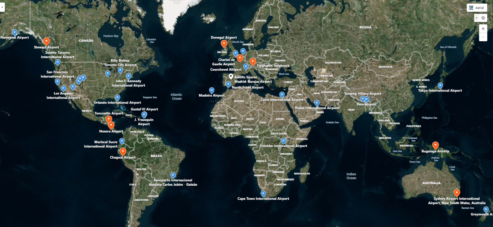
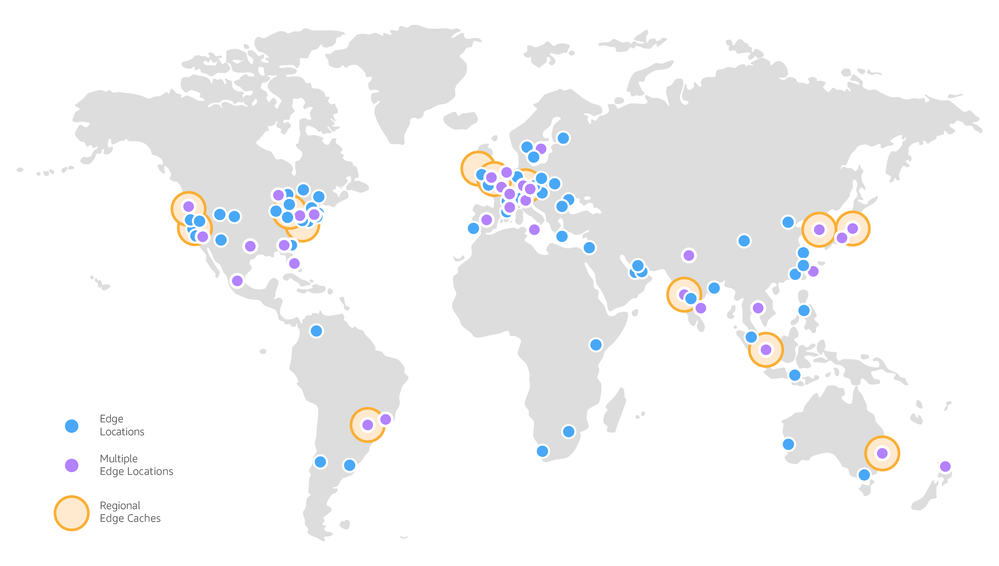
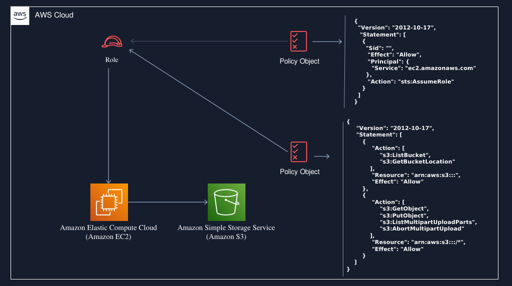
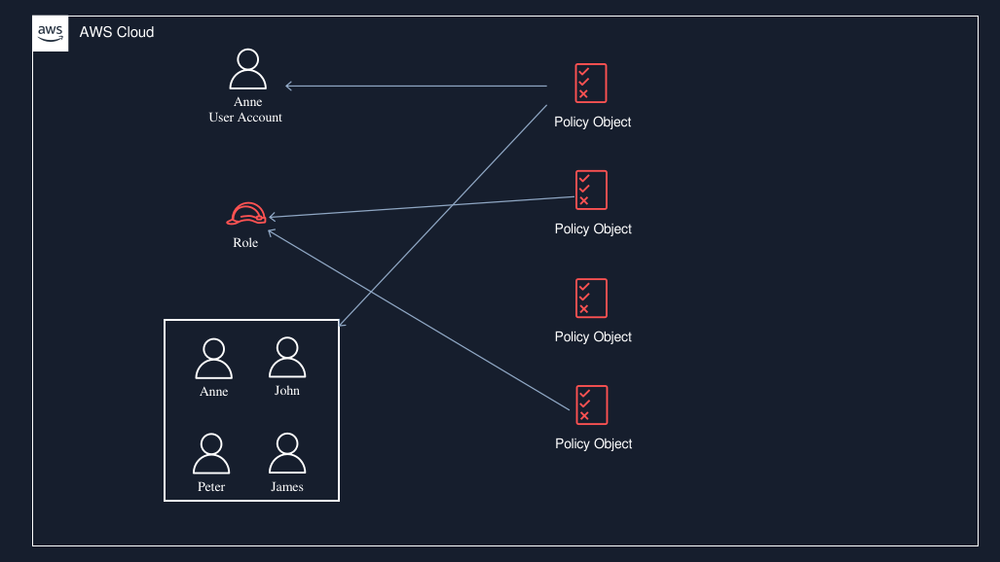
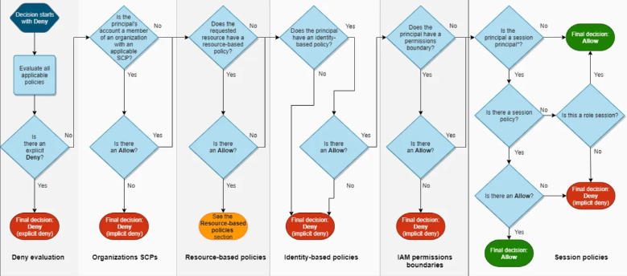
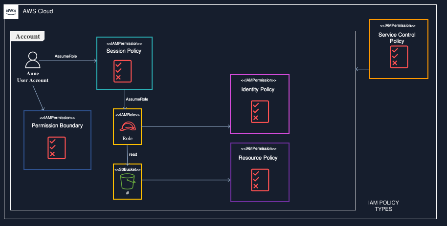

# AWS IAM: O Controle de Acesso comparando como o funcionamento de um Aeroporto Internacional


## Introdução

Nos dias de hoje, a computação em nuvem é a espinha dorsal das operações digitais de milhares de empresas ao redor do mundo. No cerne desse ecossistema dinâmico está a Amazon Web Services (AWS), uma plataforma que não apenas oferece armazenamento e processamento, mas também possibilita a construção de soluções complexas e escaláveis. Para entender a grandiosidade e a funcionalidade dessa infraestrutura global, podemos traçar um paralelo fascinante com o mapa de aeroportos do mundo.



Imagine a AWS como um vasto e interconectado sistema de aeroportos, onde cada região e cada serviço é um hub vital que se comunica com o restante da rede. Assim como os aeroportos são responsáveis por gerenciar o tráfego aéreo e garantir que milhões de passageiros e cargueiros cheguem a seus destinos com segurança e eficiência, a AWS gerencia um fluxo incessante de dados e aplicações, assegurando que as informações sejam entregues de forma precisa e em tempo hábil. Nesse contexto, o AWS Identity and Access Management (IAM) atua como o sistema de controle de acessos desses aeroportos, garantindo que apenas passageiros autorizados - ou melhor, usuários e serviços - possam acessar áreas críticas e embarcar em seus vôos para a nuvem.



Ao explorar essa analogia, perceberemos como o IAM é fundamental para a segurança na maioria dos serviços disponibilizados pela AWS. Assim como cada aeroporto possui padrões de segurança rigorosos e diferentes portões de embarque que determinam para onde os passageiros podem ir, o IAM define quem pode acessar o quê dentro da vasta gama de recursos da AWS. Vamos aprofundar essa comparação, examinando como o AWS IAM e suas credenciais funcionam como um sofisticado sistema de controle em um aeroporto, promovendo a eficácia e a segurança necessárias para operar em um ambiente complexo e global.

No mundo digital, a segurança e o controle de acesso são fundamentais. Quando falamos sobre serviços em nuvem, como a Amazon Web Services (AWS), o AWS IAM (Identity and Access Management) se destaca como um dos pilares para gerenciar quem pode fazer o quê dentro da sua infraestrutura. Para entender melhor a complexidade e a importância do AWS IAM, vamos comparar seu funcionamento com o de um aeroporto.


**O Aeroporto: Um Sistema de Controle de Acesso**

Imaginem um aeroporto, onde cada pessoa (passageiro) tem um papel específico. 

Passageiros.
Funcionários. 
Terceirizados.

Cada um possui um tipo de autorização que determina como podem interagir com o ambiente. Esse ecossistema reflete o funcionamento do AWS IAM, onde usuários, grupos e permissões garantem que apenas as pessoas certas tenham acesso aos recursos certos.

Antes de conhecer o IAM e necessario entendermos o funcionamento de um aeroporto:

### 1. Estrutura do Aeroporto

Um aeroporto é uma instalação complexa composta por diversas áreas e funções que trabalham em conjunto. Aqui estão os principais componentes:

**Terminal de Passageiros:** Onde os passageiros fazem check-in, passam pela segurança, esperam pelo embarque e desembarcam.
Pistas e Taxiways: Infraestrutura para a decolagem e aterrissagem das aeronaves, além de caminhos para o deslocamento das aeronaves no solo.

**Hangar:** Estruturas onde as aeronaves são armazenadas, mantidas e às vezes reparadas.
**Torre de Controle:** Local de onde os controladores de tráfego aéreo monitoram e gerenciam os voos, tanto dentro do espaço aéreo quanto nas operações de taxiamento no aeroporto.
**Área de Carga:** Seções específicas para o manejo de cargas e mercadorias que são transportadas por aeronaves de carga.


### 2. Processos de Funcionamento
**A. Chegada e Check-in**
Check-in: Os passageiros chegam ao terminal e fazem o check-in, que pode ser feito em quiosques automáticos ou no balcão da companhia aérea. Aqui, os passageiros recebem seu cartão de embarque e têm suas malas despachadas.

Verificação de Documentos: O check-in também envolve a apresentação de documentos, como passaporte e visto, assegurando que os passageiros estão autorizados a viajar.

**B. Segurança e Controle**
Controle de Segurança: Antes de entrar na área de embarque, todos os passageiros passam por procedimentos de segurança. Isso inclui a triagem de bagagens de mão e a verificação de itens pessoais para garantir que não haja materiais proibidos a bordo da aeronave.

Passagem pela Imigração (em voos internacionais): Para voos internacionais, os passageiros precisam passar pelo controle de imigração, onde suas documentações são checadas novamente.

**C. Acesso à Área de Embarque**
Sala de Espera: Após passar pela segurança, os passageiros chegam à sala de espera, onde podem aguardar até o momento de embarque. Essa área pode ter diversas comodidades, como lojas, restaurantes e lounges.

Embarque: Quando chega a hora, os passageiros são chamados por grupos para embarcar na aeronave. O embarque é frequentemente ordenado, garantindo que todos sigam um fluxo organizado.

**D. Voo**
Decolagem: Após o embarque, a aeronave táxi para a pista de decolagem, onde aguarda a autorização da torre de controle. A segurança é sempre uma prioridade, com os controladores gerenciando o tráfego.

Voo: Durante o voo, os pilotos seguem rotas aéreas predefinidas e se comunicam regularmente com os controladores de tráfego aéreo para garantir a segurança e eficiência.

### E. Desembarque e Finalização da Viagem
**Aterrissagem:** Ao se aproximar do destino, o avião recebe instruções da torre de controle para a aterrissagem, onde a segurança e a precisão são críticas.

**Desembarque:** Após estacionar, os passageiros desembarcam e seguem para a área de imigração (se necessário) e coleta de bagagens.

**Coleta de Bagagem:** Os passageiros retiram suas malas na área designada do terminal e completam sua experiência, seja saindo para a cidade ou conectando-se a outro voo.

### 3. Encerramento e Manutenção
**Manutenção das Aeronaves:** Após um voo, as aeronaves passam por manutenção e limpeza, prontificando-se para o próximo voo.
**Gestão do Aeroporto:** Todo o funcionamento do aeroporto é gerido por uma equipe administrativa, que cuida da logística, atendimento ao cliente, segurança e manutenção das instalações.


## Check-in: Criando Usuários e Grupos

Ao inciar e criar sua conta a **AWS tem o AWS Identity & Access Management (IAM)**, esse serviço da AWS **não possui cobrança** porem sua **importancia e vital** , pois define o uso de cadas um dos mais de [240 serviços](https://www.aboutamazon.com.br/o-que-fazemos/amazon-web-services) oferecido em, mas quando analisamos a infra global e algo muito grande:

A Nuvem AWS abrange **108 zonas de disponibilidade** em **34 regiões geográficas**, com planos anunciados para mais **18 zonas de disponibilidade** e **mais seis regiões** da AWS na México, Nova Zelândia, Reino da Arábia Saudita, Tailândia, Taiwan e na nuvem soberana europeia da AWS.
Sendo **41 zonas locais**,  **29 zonas do Wavelength** para aplicativos com latência ultrabaixa, **são 245 países e territórios atendidos** além de **135 locais do Direct Connect.**

Vamos repensar as caracteristicas da nuvem AWS pode ser comparada a uma vasta **rede de aeroportos interconectados ao redor do mundo**. Atualmente, existem **108 terminais de distribuição** __(zonas de disponibilidade)__ espalhados por **34 hubs internacionais** __(regiões geográficas)__, com planos para a adição de mais **18 terminais e seis novos hubs em locais estratégicos**, incluindo o México, Nova Zelândia, Reino da Arábia Saudita, Tailândia, Taiwan e uma **nuvem soberana na Europa**.

Dentro dessa rede, __existem 41 aeroportos locais__ que servem áreas específicas, proporcionando conectividade __próxima aos usuários__. Além disso, a AWS possui **29 terminais de Wavelength**, otimizando operações para aplicativos que **requerem latência ultrabaixa**, como sistemas de **tráfego aéreo em tempo real.**

No total, essa extensa estrutura atende **245 países e territórios**, garantindo que passageiros e cargas **possam se conectar eficientemente** a **135 destinos no Direct Connect**, permitindo uma transferência **rápida e segura de dados**, assim como o traslado de **passageiros entre diferentes pontos do globo**.

Quando recontextualizamos em termos de aeroportos e suas operações globais, facilitando a compreensão por **meio dessa analogia**.


## O usuário root:

Em um aeroporto, companhias aéreas como a **American Airlines** e a **Gol Linhas Aéreas** alugam **escritórios para operar e oferecer voos** aos seus clientes. Existem grandes companhias aéreas internacionais, como a **Lufthansa**, que conectam diversos continentes, assim como pequenas companhias, como a **Azul**, que realizam operações locais em mercados específicos.

Quando uma companhia aérea decide operar em um aeroporto, **ela assina um contrato (termos de uso)**, que nos assinamos ao se cadastrar na AWS, para utilizar os serviços oferecidos por essa **instalação(AWS)**. 

Suponhamos que a **Delta Air Lines**, por exemplo, faça esse arranjo; **o gerente regional dela, que representa a empresa naquele aeroporto**, assina o contrato e, dessa forma, obtém as "chaves" para o escritório, permitindo que ele e sua equipe acessem todas as áreas necessárias para a operação dos voos.

No caso a certas leis , que obrigam a certo nichos de manterem seus dados somente na Região de uso, obedecendo as **leis daquela Pais**(Zonas de disponibilidade), exemplos clientes  **financeiros e Hospitais**.

O gerente regional de uma companhia aérea, como a **Delta Air Lines**, não pode administrar o escritório sozinho. Para garantir que tudo funcione corretamente, **ele ou ela** deve **contratar uma equipe**, que pode incluir **agentes de vendas, agentes de operações, manipuladores de bagagem, despachantes de voo e suporte administrativo**. 

No final, o gerente distribui responsabilidades enquanto cuida da supervisão.

Analogamente, ao criar uma conta AWS pela primeira vez, você recebe uma identidade de login única chamada usuário raiz, que tem acesso total a todos os serviços e recursos. 

Embora seja possível realizar qualquer tarefa como **usuário raiz** utilizando o e-mail e a senha da conta.

Recomendação forte da AWS que esse usuário não seja utilizado para atividades diárias, mesmo as administrativas. Em vez disso, deve-se criar **usuários do IAM**, **atribuir permissões** específicas a eles e **manter as credenciais do usuário raiz seguras**, reservando seu uso apenas para tarefas essenciais de gerenciamento - para que a conta também possa "descansar", e se precaver de possíveis problemas relacionado ao usuário raiz.


## Usuários do IAM:

Assim como os passageiros realizam o check-in antes do embarque, no AWS IAM, você começa criando usuários e grupos. Os usuários representam indivíduos ou serviços que precisam acessar seus recursos na AWS. Já os grupos são como filas de check-in, onde você pode agrupar usuários com necessidades semelhantes.

**Usuários:** Cada usuário recebe credenciais (equivalente ao bilhete de embarque) que o identificam e permitem o acesso à conta da AWS.


Suponha que o gerente de uma companhia aérea, como a **American Airlines**, contratou diversas pessoas para desempenhar funções distintas no aeroporto. 
Ele atribuiu **credenciais e permissões específicas a cada um**. Por exemplo, os **agentes de vendas** estão no balcão de atendimento, em contato direto com os clientes, mas nunca têm acesso à **área de embarque**. Em contraste, os **manipuladores de bagagem** possuem **autorização para entrar na área aérea**, onde podem **transportar as bagagens até as aeronaves**.

Da mesma forma, na AWS, um **usuário IAM representa uma entidade** criada para interagir com os **serviços da nuvem**. Assim como no aeroporto, cada **usuário AWS possui** um **nome e credenciais** que determinam quais serviços e recursos ele pode acessar, **dependendo das permissões atribuídas.**

Quando um novo **usuário IAM é criado por meio da AWS CLI ou da API da AWS ou pelo console**, ele inicialmente não possui credenciais. Assim como o gerente precisa designar credenciais para funcionários baseadas em suas responsabilidades, você também deve criar o tipo de credenciais necessárias para um usuário IAM, de acordo com suas funções específicas na AWS e em momento alguns deste usuários, podem ter permissões em outros aeroportos que no caso suas credenciais, no caso a AWS possui  **AWS Organizations** onde você pode habilitar ou desabilitar zonas o que seria o mesmo que restringir o acesso daquele funcionario a outro aeroporto, o limitando sua credencial somente a uma area geografica como exemplo América, o mesmo não teria acesso a aeroportos da Europa.

Há mais o gerente tem que criar esse quantidade e gerenciar isso se torna dificil e complexo , neste caso a AWS fornece o **Control Tower**, que possibilita um controle melhor do ambiente organizacional nas criação de usuários.


## Grupos IAM

Grupos: Os grupos organizam usuários com **permissões similares**, simplificando o gerenciamento. Um grupo de “Embarque de bagagens”, por exemplo, pode ter permissões específicas para gerenciar a conseguir acessar a área de bagagens do aeroporto e também a área de embarque e desembarque onde os aviões ficam estacionados.

Você conhece os **cartões de acesso**? Esses cartões são utilizados para conceder **acesso a áreas restritas** a quem os possui. Assim, o gerente do aeroporto pode programar quais **portas ou áreas serão acessíveis** com cada cartão.

Nesse cenário, o gerente decidiu fornecer cartões de acesso de cores diferentes para os funcionários, de acordo com as permissões que eles precisam. Por exemplo: 
Grupo de dez pessoas. 
Responsáveis pela **manutenção das aeronaves**. 
Todos eles receberam **cartões laranja**, que permitem acesso às áreas restritas onde ocorre a manutenção das aeronaves.

Agora, vamos imaginar que um funcionário do grupo de **manutenção seja promovido** a uma nova função. O que acontece então? É simples: **ele fará parte de outro grupo**, retornará seu cartão laranja e **receberá um novo cartão** que lhe dará acesso às **áreas necessárias para sua nova função.**


No aeroporto, **um grupo de empregados pode ser comparado a um conjunto de usuários de acesso**. Esses grupos permitem que o gerente especifique permissões para uma coletividade de funcionários, **facilitando o gerenciamento das credenciais**. 

Por exemplo, o gerente pode ter um grupo chamado **"controladores de tráfego"** e atribuir a esse grupo as **permissões necessárias para operar no balcão de atendimento**. Qualquer funcionário que integre **esse grupo automaticamente** terá as permissões que foram atribuídas a ele.

Se um **novo funcionário ingressar** na equipe do aeroporto e precisar de privilégios de atendimento ao cliente, **basta adicioná-lo ao grupo** "controladores de tráfego" para que ele receba as permissões adequadas. Da mesma forma, se um funcionário mudar de função, em vez de **alterar suas permissões individualmente**, o gerente pode **removê-lo do grupo** anterior e **adicioná-lo ao novo grupo**, conforme necessário.

**Informações adicionais sobre Grupos:**
 - Grupos podem conter vários usuários, mas não podem conter outros Grupos ou Funções.
 - Um usuário não precisa pertencer a nenhum Grupo IAM.
 - Um Usuário pode pertencer a vários Grupos.


## IAM Roles

Primeiramente devemos entender o que uma IAM Roles.

**1. O que é um IAM Role?**

Um IAM Role é uma **identidade que possui permissões específicas**. As roles são usadas para delegar acesso a serviços e recursos da AWS sem a necessidade de criar credenciais permanentes.

Sabendo então que uma IAM Role na AWS é como um **cartão de acesso temporário** que é emitido a funcionários ou sistemas no aeroporto, podemos então entender que  esse acesso permitindo ao funcionario ou terceiros, pessoa de fora do nosso funcionarios exemplo um auditor de uma instituição, que **recebe essa credencial temporária** para  acessar áreas específicas ou realizar determinadas tarefas apenas quando **necessário e por um período limitado**.

**2. Como as IAM Roles Funcionam:**
**Assunção do Papel:** Imagine que um mantenedor de aeronaves que normalmente trabalha na área de manutenção precisa, **temporariamente, acessar a área de embarque** para transportar ferramentas ou **realizar uma verificação**. Em vez de ter um cartão de acesso permanente para essa área, ele pode **"assumir" um papel (role)** que lhe dá a permissão necessária por um **tempo limitado**. Essa é uma forma de controle de acesso dinâmico.

**Credenciais Temporárias:** Assim que o mantenedor assume o papel, ele recebe **credenciais temporárias (como um código ou um cartão)** que lhe permitem acessar a área de embarque apenas durante o período em que realmente precisa estar lá, **garantindo que ele não tenha acesso ilimitado.**

**3. Cenários de Uso Comuns:**
**Equipe de Carga e Descarga:** Os membros da equipe que lidam com a carga de bagagens podem precisar de acesso à pista de pouso de tempos em tempos. **Um IAM Role pode ser criado especificamente para essa função**, permitindo que funcionários assumam o papel quando estão fazendo esse trabalho, garantindo que apenas as pessoas certas tenham acesso à área quando necessário.

**Segurança Temporária:** Digamos que haja uma situação especial onde a **equipe de segurança do aeroporto precise de acesso à sala de controle** ou a uma **área restrita** para garantir a **segurança durante um evento**. Eles podem usar um papel que lhes conceda esse acesso temporário, **garantindo que eles possam agir de forma rápida e eficiente sem a necessidade de ter acesso contínuo**

**Mas e como funciona isso dentro da AWS?**



O recurso AssumeRole no IAM (Identity and Access Management) da AWS é um mecanismo que permite que um usuário ou serviço **"assuma" um papel (role) temporário** que concede permissões específicas para realizar ações em diferentes serviços da AWS. Esse recurso é fundamental para a delegação de acesso e gerenciamento de permissões em ambientes complexos.

### Como Funciona o AssumeRole
**Criação de um Role:** Um administrador do AWS IAM cria um IAM Role com um conjunto específico de permissões (políticas) e define quais entidades têm permissão para assumir esse papel. O IAM Role não é associado a um usuário em particular; em vez disso, ele pode ser usado por vários usuários, serviços ou até por aplicações na AWS.

**Permissão para Assumir o Role:** A política de confiança (trust policy) associada ao role define quais entidades (usuários, serviços, ou contas) podem assumir aquele role. Por exemplo, um role pode permitir que um usuário de uma conta A assuma um role em uma conta B.

**Assumindo o Role:** Quando uma entidade **(como um usuário ou uma instância EC2)** precisa realizar ações para as quais **não possui permissões**, ela executa a operação **AssumeRole**. Isso gera credenciais temporárias que **permitem que a entidade atue sob as permissões definidas pelo role**.

**Uso das Credenciais Temporárias:** Uma vez que o **AssumeRole é bem-sucedido**, a entidade recebe um conjunto temporário de credenciais **(Access Key ID, Secret Access Key e Session Token)** que pode ser usado para interagir com os serviços da AWS de acordo com as **permissões do role.

**Duração das Credenciais Temporárias:** Essas credenciais têm uma duração limitada configurável (geralmente de alguns minutos a algumas horas) e não precisam ser salvas ou gerenciadas permanentemente.

### Cenários de Uso Comuns para AssumeRole
**Delegação de Responsabilidades:** Um usuário em uma conta pode assumir um role em outra conta para realizar tarefas específicas, permitindo a colaboração entre contas diferentes sem compartilhar credenciais permanentes.

**Acesso Temporário:** Aplicações em execução em instâncias do EC2 podem assumir roles para acessar outros serviços da AWS (como S3, DynamoDB, etc.) sem a necessidade de armazenar credenciais permanentes.

**Sistemas Baseados em Eventos:** Permitir que funções Lambda assumam roles para realizar tarefas específicas quando acionadas por eventos, como acessar bancos de dados ou serviços de armazenamento.

**Privilégios Elevados:** Usuários podem ter a capacidade de assumir um role com permissões elevadas para administração ou configurações temporárias que não são habilitadas por padrão.

### Exemplo Prático:
Suponha que você tenha um role chamado **"AdminRole"** com permissões administrativas para **gerenciar recursos da AWS**. O role tem uma política de confiança que permite que **usuários da conta A o assumam**.

- Um usuário da conta A faz uma solicitação via API para AssumeRole para o role "AdminRole".
- A AWS verifica a confiança definida na política do role e, se for aprovada, autentica a solicitação.
- O usuário recebe credenciais temporárias para o role.
- Com essas credenciais, o usuário pode gerenciar recursos conforme permitido pelo role "AdminRole".


## Multi-Factor Authentication (MFA)

**1. O que é MFA?**
A Autenticação de Múltiplos Fatores (MFA) é um método de confirmação da identidade de uma pessoa que requer mais de um fator para autenticação. No contexto de um aeroporto, isso pode ser comparado a um sistema de segurança que exige que um funcionário apresente várias formas de identificação antes de obter acesso a áreas restritas.

**2. Como a MFA Funciona no Aeroporto:**
**Fator 1:** 
- **Cartão de Identificação (ID):** O primeiro fator poderia ser o cartão de identificação do funcionário, **semelhante a um crachá** que prova que ele é um membro da equipe do aeroporto, permitindo acesso a áreas específicas. **Esse cartão, normalmente, contém algumas informações básicas e uma foto.**

**Fator 2:** 
- **Código de Acesso (Senha ou PIN):** O segundo fator é um **código de acesso ou PIN** que o funcionário deve inserir ao apresentar seu **cartão de identificação**. Este código pode ser gerado por um dispositivo, **como um token de segurança ou um smartphone**, e muda regularmente para garantir segurança adicional.

**Fator 3 (Opcional):** 
-  **Biometria:** Para fortalecer ainda mais a segurança, **o aeroporto pode implementar um terceiro fator**, como a verificação **biométrica (por exemplo, uma impressão digital ou reconhecimento facial)** na entrada de áreas altamente sensíveis, como a **sala de controle ou a pista de pouso**.


## Políticas do IAM (Permissões)

Um usuário, grupo ou função do IAM pode receber um documento JSON chamado Política do IAM, por exemplo:

**1. O que são IAM Policies?**

No contexto da AWS, **IAM Policies são regras que definem as permissões que os usuários** ou **grupos têm em relação a ações em recursos específicos**. 
Em um aeroporto, essas políticas podem ser comparadas a **normas e regulamentos que determinam quem pode fazer o quê em diferentes áreas do aeroporto**.

**2. Tipos de Políticas no Aeroporto:**
Para entender melhor, vamos considerar diferentes tipos de políticas que poderiam **existir em um aeroporto:**

**Política de Acesso à Área:** Uma política que define quais funcionários podem acessar quais áreas do aeroporto. Por exemplo, somente a equipe de manutenção pode acessar a área de manutenção de aeronaves. Essa política pode especificar que somente membros de um grupo nomeado, como **"Mantenedores", têm acesso a certas áreas, como a pista ou o hangar.**

**Política de Ação:** Essa política determina quais ações um **funcionário pode realizar em uma área específica**. Por exemplo, um agente de segurança pode ter permissão para **"inspecionar" e "autuar"** na zona de **segurança**, enquanto um agente de **check-in** pode ter permissão para **"check-in"** e **"emissão de cartões de embarque"**.

**Política de Conformidade:** Essas políticas podem garantir que os funcionários sigam os **procedimentos regulatórios**. Por exemplo, todos os empregados devem passar por um treinamento de segurança antes de obter acesso às **áreas restritas**. A política pode exigir que novos funcionários completem esse treinamento para **receberem suas credenciais de acesso**.

**3. Como Funciona na Prática:**
**Imagine que um novo funcionário é contratado** para o aeroporto. Para garantir que as permissões sejam adequadas, **o gerente de segurança configura as seguintes IAM Policies:**

**Definição de Grupos:** O gerente cria grupos para diferentes funções, como **"Segurança"**, **"Manutenção"**, **"Atendimento ao Cliente"**. Isso facilita a organização das permissões.



**Atribuição de Permissões:** Em seguida, o gerente define políticas que conectam esses grupos a ações e áreas. Por exemplo:

**Grupo de Segurança:** Permissão para realizar inspecções, monitorar câmeras, controlar entradas e saídas.
**Grupo de Manutenção:** Permissão para acessar áreas de hangar, operar equipamentos de manutenção.
**Grupo de Atendimento ao Cliente:** Permissão para acessar áreas de check-in e embarque, emitir cartões de embarque.
**Revisão e Atualização de Políticas:** À medida que funcionários mudam de função ou novos procedimentos são implementados (como um novo tipo de verificação de segurança), as políticas precisam ser revisadas e atualizadas. 

Se um membro da equipe de manutenção for promovido para um cargo de segurança, **ele pode ser removido do grupo de manutenção e alocado ao grupo de segurança**, mudando automaticamente suas permissões.

**4. Importância das IAM Policies no Aeroporto:**
As políticas de permissões são cruciais para a operação segura e eficiente de um aeroporto, pois garantem que:

- Apenas pessoas autorizadas tenham acesso a áreas e recursos específicos.
- As ações realizadas pelos funcionários sejam monitoradas e controladas.
- A conformidade com regulamentos de segurança e operacionais seja mantida.


**5. Exemplo Prático:**
Considere um momento em que a equipe de segurança da área do portão **precisa acessar registros de incidentes**. As IAM Policies definiriam:

**Quem Tem Acesso:** Somente membros do grupo de **"Segurança"**.
Quais Ações Podem Ser Feitas: Podem **"visualizar"** e **"registrar"** incidentes, mas não **"editar"** ou **"deletar"** registros históricos.

Certo, mas um detalhe como é definido estas policies do IAM?

Podemos ver esses elementos dentro do JSON de um documento de política ao examinar qualquer uma das políticas existentes disponíveis para nós em nossa conta AWS.
Vamos dar uma olhada naquela com a qual já estamos familiarizados – a **política AdministratorAccess:**

```json
{
 "Version": "2012-10-17",
 "Statement": [
    {
    "Effect": "Allow",
    "Action": "*",
    "Resource": "*"
    }
 ]
}
```

Note que essa policies da permissão a todos os recursos, ou seja pode acessar e usar qualquer parte do aeroporto, criar , editar, alterar e excluir qualquer coisa dentro da sua conta.

```json
{
  "Version": "2012-10-17",
  "Id": "MyPolicy",
  "Statement": [
    {
      "Sid": "FirstStatement",
      "Effect": "Allow",
      "Action": ["iam:ChangePassword"],
      "Resource": "*"
    },
    {
      "Sid": "SecondStatement",
      "Effect": "Allow",
      "Action": "s3:ListAllMyBuckets",
      "Resource": "*"
    },
    {
      "Sid": "ThirdStatement",
      "Effect": "Allow",
      "Action": [
        "s3:List*",
        "s3:Get*"
      ],
      "Resource": [
        "arn:aws:s3:::confidential-data",
        "arn:aws:s3:::confidential-data/*"
      ],
      "Condition": {"Bool": {"aws:MultiFactorAuthPresent": "true"}}
    }
  ]
}

```

Neste caso aqui já temos uma policies, segmentada com cada ação especificada  e os recursos, que quem receberá essa policies, diretamente no usuário ou dentro de um grupo, ou dentro de uma Role.


### Lógica de avaliação

Após coletar as declarações efetivas usando os filtros, ele usa a lógica de avaliação de política para decidir se a solicitação é permitida. A documentação da AWS tem uma imagem descritiva para resumir como funciona:




#### Tipos de políticas
Existem diferentes tipos de políticas, dependendo do que elas estão vinculadas:

- SCP: anexado à conta por meio de Organizações
- Política baseada em recursos: anexada ao recurso que está sendo chamado, como um bucket S3
- Limite de permissão: anexado a uma identidade como um limite
- Política de sessão: anexada à sessão de assumir função
- Política baseada em identidade: anexada a uma identidade , como um usuário do IAM



O SCP, o limite de permissões e a política baseada em sessão são específicos para um caso de uso e são opcionais. Se você não usá-los, eles não afetarão a avaliação da política, o IAM os ignora. Os dois tipos mais importantes são as políticas baseadas em identidade e baseadas em recursos . A maioria das políticas é desses dois tipos.


Conclusão
A comparação entre AWS IAM e um aeroporto nos ajuda a entender a importância de um gerenciamento de identidade e acesso eficaz. Ao criar usuários e grupos, definir políticas de acesso e implementar medidas de segurança como o MFA, você pode garantir que seus dados e recursos na nuvem estejam protegidos.

Assim como em um aeroporto, onde a segurança e a eficiência são primordiais, no ambiente da AWS, o IAM é essencial para garantir que apenas as pessoas certas tenham acesso aos recursos certos. O gerenciamento adequado do IAM não apenas protege sua infraestrutura, mas também otimiza operações, proporcionando um ambiente de nuvem seguro e eficiente.
